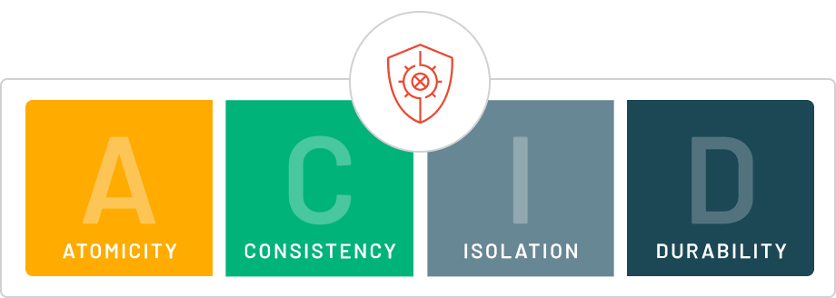

---

  
---

`ACID` features are used by Database Management Systems (DBMS) to maintain data integrity and consistency.  Atomicity`, `Consistency`, `Isolation`, and `Durability` `(ACID) are basic concepts ensuring a database's `transactional integrity`. 

These four key properties define how a transaction should be processed in a reliable and predictable manner, ensuring that the database remains consistent, even in cases of failures or concurrent accesses.

A `transaction` in DBMS refers to a sequence of operations performed as a single unit of work. These operations may involve reading or writing data to the database. 

> To `maintain data integrity`, DBMS ensures that each transaction adheres to the ACID properties. 

---

*Think of a transaction like an ATM withdrawal. When we withdraw money from our account, the transaction involves several steps:*

1. Checking your balance.

1. Deducting the money from your account.

1. Adding the money to the bank's record.

---

# The Four ACID Properties

## 1. `Atomicity` - "All or Nothing"
---
* Atomicity guarantees that all of the commands that make up a transaction are treated as a single unit and either succeed or fail together. 

* This is important in the event of a system failure or power outage, in that if a transaction wasn't completely processed, it will be discarded and the database maintains its data integrity.

> This not only `reduces the chances of storing duplicate data` but also improves the overall efficiency of the database.

1. `Commit`: If the transaction is successful, the changes are permanently applied.
1. `Abort/Rollback`: If the transaction fails, any changes made during the transaction are discarded.

## 2. Consistency for maintaining valid data states

* Consistency ensures that a `database remains` in a `valid state before and after a transaction`.

 * It guarantees that any transaction will take the database from one consistent state to another, maintaining the rules and constraints defined for the data. 

* In simple terms, a transaction should only take the database from `one valid state to another`.

 > If a transaction violates any database rules or constraints, it should be rejected, ensuring that only consistent data exists after the transaction.

---

## 3. Isolation for ensuring concurrent transactions don't interfere with each other

* It ensures that `multiple transactions can occur concurrently` without leading to the inconsistency of the database state. 

* `Transactions occur independently` without interference. 

* Changes occurring in a particular transaction will not be visible to any other transaction until that particular change in that transaction is written to memory or has been committed.

* This property ensures that when multiple transactions run at the same time, the result will be the same as if they were run one after another in a specific order.

 > It prevents issues such as `dirty reads` (reading `uncommitted data`), `non-repeatable reads` (`data changing between two reads in a transaction`), and phantom reads (new rows appearing in a result set after the transaction starts).

---

## 4. Durability for persisting changes
* It ensures that once the `transaction has completed execution`, the `updates and modifications` to the database are stored in and written to disk and they persist `even if a system failure occurs`. 

* These updates now become permanent and are stored in non-volatile memory. 

> In the event of a failure, the DBMS can recover the database to the state it was in after the last committed transaction, ensuring that no data is lost.