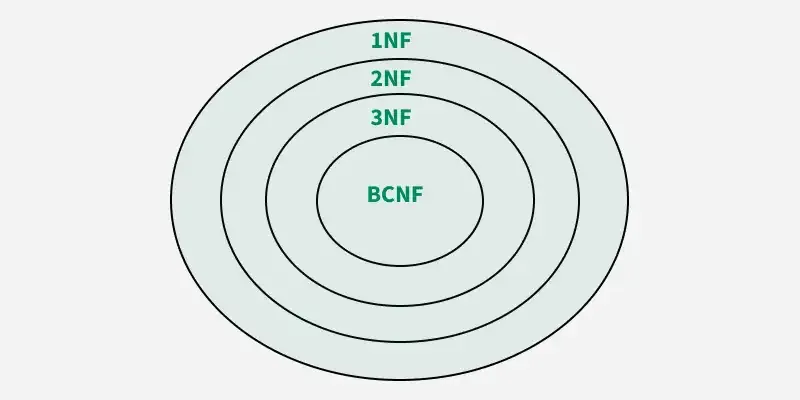

# Database Normalization

## What is Database Normalization?

* Normalization is a systematic approach to organize data within a database to `reduce redundancy` and `eliminate 
undesirable characteristics` such as insertion, update, and deletion anomalies.

* The process involves breaking down large tables into smaller, well-structured ones and defining relationships 
between them. 

> This not only `reduces the chances of storing duplicate data` but also improves the overall efficiency
 of the database.

## Benefits of Database Normalization

### 1. Reduces Data Redundancy
* Duplicate data is stored efficiently, saving disk space and reducing inconsistency.

### 2. Improves Data Integrity
* Ensures the accuracy and consistency of data by organizing it in a structured manner.

### 3. Simplifies Database Design
* Following a clear structure where database designs become easier to maintain and update.

### 4. Optimizes Performance
* Reduces the chance of anomalies and increases the efficiency of database operations.

## Normal Forms

* Normalization is a technique used in database design to reduce redundancy and improve data integrity by organizing data into tables and ensuring proper relationships.

The normal forms include;

1. First Normal Form (1NF)
1. Second Normal Form (2NF)
1. Third Normal Form (3NF)
1. Boyce-Codd Normal Form (BCNF)
1. Fourth Normal Form (4NF)
1. Fifth Normal Form (5NF)

---
  

  

> Normal Forms are different stages of normalization, and each stage imposes certain rules to improve the structure and performance of a database.

---

## 1. First Normal Form (1NF) mainly are for eliminating duplicate records 

### A table is in 1NF if;

A table is in `1NF` if:

1. All columns contain indivisible values.   
1. Each row is unique with no duplicate rows.  
1. Each column has a unique name. 

## NB: 
####  The order in which data is stored does not matter. 

### For instance

* When a table has a column "Phone Numbers" that stores multiple phone numbers in a single cell, it violates 1NF.

* > To bring it into 1NF, you need to separate phone numbers into individual rows.

---

## 2. Second Normal Form (`2NF`) mainly eliminates partial Dependency

* A relation is in 2NF if it satisfies <b>`1NF`</b> and no partial dependency exists, meaning every non-prime attribute (non-key attribute - an attribute that is part of a candidate key) must depend on the entire primary key, not just a part of it.

### For instance

* if a **`composite key`* ** <em>(a key that is made up of two or more attributes that together uniquely identify each row in a table)</em> such as `(StudentID, CourseID)` where `StudentName` depends only on `StudentID` and not on the entire key - this violates 2NF.

*Solution/action to do*: 

> Move `StudentName` into a separate table where it depends only on `StudentID`.

---

## 3. Third Normal Form (3NF) mainly eliminating transitive dependency 

 `Transitive dependency` is a dependency that is not directly included in a project, but is included by a direct dependency or another transitive dependency.

- A relation is in 3NF if it satisfies **2NF** 

- Non-prime attributes should not depend on other non-prime attributes.

### For isntance

* In a table with `(StudentID, CourseID, Instructor)` 

I must check if

- `Instructor` depends on `CourseID`

or

- `CourseID` depends on `StudentID`

* Then, if `Instructor` indirectly depends on `StudentID`, this will have violated 3NF.

*Solution/action to take*: i must olace `Instructor` in a separate table linked by `CourseID`.

---

## 4. Boyce-Codd Normal Form (`BCNF`) takes the Strongest Form of `3NF`

### Requirements for BCNF

* BCNF is a stricter version of 3NF where for every non-trivial functional dependency `(X → Y)`, X must be a **superkey** (a unique identifier for a record in the table).

* A **`superkey`**  is a set of one or more attributes (columns) that, when combined, can uniquely identify a row (tuple) in a table.

### For instance

* If a table has a dependency `(StudentID, CourseID) → Instructor`, but neither `StudentID` nor `CourseID` is a superkey, then it violates BCNF.

*ACTION TO TAKE/SOLUTION*: 

* Decompose the table so that each determinant is a candidate key.

* A `candidate key` is a set of attributes that can uniquely identify each record (tuple) in a table.

---

## 5. Fourth Normal Form (4NF) removing multi-valued dependencies in a table

### Requirements for 4NF

* A table is in 4NF if it is in **`BCNF`** and has no multi-valued dependencies. A multi-valued dependency occurs when one attribute determines another, and both attributes are independent of all other attributes in the table.

*`Multi-Valued Dependency (MVD)` is a database property indicative of a certain type of functional dependency (FD) between columns of a database table*

### for instance

* In a table where `(StudentID, Language, Hobby)` are attributes, if a student can have multiple hobbies and languages, a multi-valued dependency exists.

*thus the solution is*

**action to take/ solution**: Split the table into separate tables for Languages and Hobbies.

---

## 6. Fifth Normal Form (5NF) eliminates joined Dependencies

* 5NF is achieved when a table is in **4NF** and all join dependencies are removed.

* This form ensures that every table is fully decomposed into smaller tables that are logically connected without losing information.

### for instance,

* If a table contains `(StudentID, Course, Instructor)` and there is a dependency where all combinations of these columns are needed for a specific relationship, i must split them into smaller tables to remove redundancy.

---
